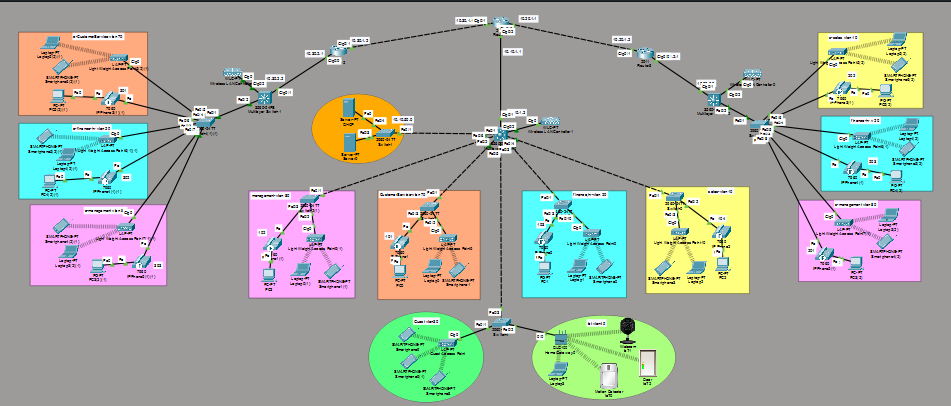

# Enterprise Network Design & Implementation

## Network Topology

  

## Project Description

Designed and implemented a large-scale enterprise infrastructure using Cisco Packet Tracer.

## Technologies

- VLANs
- DHCP
- WLC
- Access Points
- IP Phones
- EtherChannel
- IoT

## Key Achievements

- Implemented network segmentation using VLANs.
- Configured Inter-VLAN Routing.
- Integrated wireless infrastructure using WLC.
- Added VoIP communication using IP Phones.
- Connected IoT devices in dedicated network segments.
